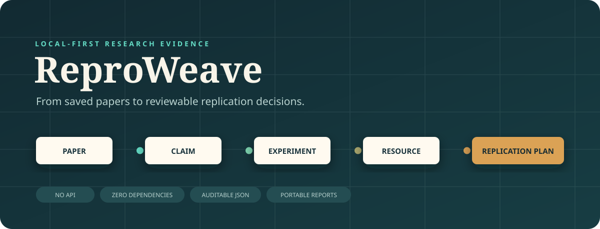

<div align="center">
  

  # ReproWeave

  **Turn papers into auditable evidence maps and executable replication plans — locally, without an API.**

  [](https://github.com/CAOShurong/reproweave/actions/workflows/ci.yml)
  [](https://caoshurong.github.io/reproweave/)
  [](https://www.python.org/)
  [](#why-local-first)
  [](LICENSE)
</div>

ReproWeave is a file-native research tool for engineers and AI researchers. It connects each
paper to the claims you care about, the exact figure or appendix that supports them, the
experiments and resources they depend on, a transparent reconstructability assessment, and a
dependency-aware plan for testing the work yourself.

It deliberately does **not** scrape PDFs, call a language model, assign a hidden “paper quality”
score, or require a cloud account. You supply the evidence; ReproWeave keeps the reasoning
reviewable.

## See it before installing

- [Project website](https://caoshurong.github.io/reproweave/)
- [Interactive synthetic evidence report](https://caoshurong.github.io/reproweave/demo/evidence-report.html)
- [Synthetic evidence matrix](examples/demo/reports/evidence-matrix.csv)
- [Synthetic replication plan](examples/demo/reports/replication-plan.md)

Every record in the demonstration is fictional. It exists to show the workflow without
misrepresenting a real paper, author, repository, score, or experimental result.

## The problem it solves

A citation library answers “what did I save?” A reproducibility checklist asks “what did the
authors disclose?” A project tracker asks “what should I do next?” ReproWeave joins these views
without pretending they are the same:

```text
paper → claim → evidence locator → experiment → code/data/hardware
                                               ↓
                                  transparent assessment
                                               ↓
                                  dependency-aware task plan
                                               ↓
                                  audit + evidence seal + report
```

The result is useful when deciding which paper to reproduce, preparing a lab meeting, scoping a
benchmark, handing work to a collaborator, or explaining why an experiment is blocked.

## Quick start

ReproWeave needs Python 3.11 or newer and has no runtime dependencies.

```bash
python -m pip install reproweave
reproweave demo my-review
reproweave audit --workspace my-review
reproweave report --workspace my-review
```

For development directly from the repository:

```bash
git clone https://github.com/CAOShurong/reproweave.git
cd reproweave
python -m pip install -e .
reproweave demo scratch/demo
```

Open `scratch/demo/reports/evidence-report.html` in any modern browser. The report is one
self-contained HTML file: no server, JavaScript package, font request, or analytics endpoint.

## A real workflow

### 1. Create the review boundary

```bash
reproweave init reviews/edge-ai \
  --title "Edge AI replication candidates" \
  --question "Which latency claims can be reconstructed on our hardware?" \
  --owner "Your Lab"
```

Edit `reviews/edge-ai/reproweave.json` to record inclusion criteria before screening.

### 2. Import references offline

```bash
reproweave import bibtex library.bib --workspace reviews/edge-ai
reproweave import csl-json selected.json --workspace reviews/edge-ai
```

The importers cover the portable subset needed for review records. Keep the original export in
version control because ReproWeave is not a full BibTeX macro engine or citation manager.

### 3. Add evidence artifacts

Artifacts are plain JSON. Add them by writing files in their documented directories or through
the validated CLI:

```bash
reproweave add claim claim.json --workspace reviews/edge-ai
reproweave add assessment assessment.json --workspace reviews/edge-ai
reproweave add task task.json --workspace reviews/edge-ai
```

Each claim requires an `evidence_locator` such as `Figure 4`, `Appendix B.2`, or
`repository/results.csv`. A rating requires a written evidence note. Missing facts remain
`unknown`; they are never filled by inference.

### 4. Inspect gaps and plan execution

```bash
reproweave assess --workspace reviews/edge-ai
reproweave matrix --workspace reviews/edge-ai --format csv --output matrix.csv
reproweave backlog --workspace reviews/edge-ai
reproweave plan --workspace reviews/edge-ai --format markdown --output plan.md
```

Task dependencies become execution waves. Tasks in one wave can run in parallel; later waves
wait for their declared prerequisites. Effort values remain human estimates.

### 5. Audit and seal the review

```bash
reproweave audit --workspace reviews/edge-ai
reproweave seal --workspace reviews/edge-ai
reproweave verify --workspace reviews/edge-ai
```

The audit checks artifact schemas, cross references, task cycles, and assessment coverage. The
seal hashes the manifest and every source artifact with SHA-256. It proves that a specific
workspace snapshot has not changed; it does **not** prove that a scientific claim is true.

## The eight-dimension rubric

| Dimension | What the reviewer must establish | Weight |
|---|---|---:|
| Method specificity | An independent reader can reconstruct the method | 1.25 |
| Data availability | Exact inputs are available or reconstructable | 1.25 |
| Code availability | Runnable, versioned, sufficiently licensed code exists | 1.00 |
| Environment capture | Software, dependencies, hardware, and seeds are recorded | 1.00 |
| Metric definition | Metrics, aggregation, and uncertainty are specified | 1.00 |
| Baseline traceability | Baseline identity and settings can be found | 0.75 |
| Compute disclosure | Training or experimental compute is bounded | 0.75 |
| Result traceability | Headline results link to configurations and artifacts | 1.25 |

Ratings are `yes`, `partial`, `no`, `unknown`, or `na`. Scores summarize documented
reconstructability only. They do not measure correctness, novelty, importance, statistical
validity, fairness, or research integrity. Read [the scoring methodology](docs/methodology.md)
before comparing projects.

## Workspace anatomy

```text
review/
├── reproweave.json          # scope and screening criteria
├── papers/                  # bibliographic identity
├── claims/                  # bounded statements + evidence locators
├── experiments/             # protocol summaries and resource links
├── resources/               # code, data, environments, models, hardware
├── assessments/             # explicit rubric ratings and next actions
├── tasks/                   # replication DAG, states, estimates, acceptance
├── screening/               # inclusion/exclusion decision trail
├── reports/                 # generated HTML, CSV, Markdown, and JSON
└── reproweave-seal.json     # content-addressed source snapshot
```

Seven published [JSON Schemas](schemas/) document the durable artifacts. Runtime validation uses
the same conservative vocabulary without adding a JSON Schema dependency.

## Commands

| Command | Purpose |
|---|---|
| `init` | Create a review workspace |
| `import` | Import BibTeX or CSL JSON |
| `add` | Validate and add one JSON artifact |
| `assess` | Calculate rubric coverage and common gaps |
| `matrix` | Export a paper-by-dimension matrix |
| `backlog` | Rank unresolved evidence work |
| `graph` | Export the typed evidence graph |
| `plan` | Build dependency waves and effort summaries |
| `audit` | Check artifacts, references, cycles, and coverage |
| `report` | Generate a self-contained interactive HTML report |
| `seal` | Hash the complete source set |
| `verify` | Compare the current source set with a saved seal |
| `demo` | Generate the fictional EE/AI example |

Run `reproweave COMMAND --help` for exact options.

## Why local-first?

Literature assessments often contain unpublished research questions, early replication choices,
reviewer notes, or links to restricted datasets. ReproWeave keeps those records in ordinary files
that can stay on your device, live in a private repository, or enter your lab's existing backup
system. No data is uploaded by the application.

“Local-first” is not a security guarantee. Repository permissions, disk encryption, backups, and
the sensitivity of quoted material remain your responsibility. See [SECURITY.md](SECURITY.md).

## What ReproWeave is not

- It is not Zotero, a PDF reader, a systematic-review search engine, or a reference formatter.
- It does not claim formal PRISMA compliance or automate database search.
- It does not execute third-party repositories or sandbox untrusted research code.
- It does not reproduce an experiment merely because the audit passes.
- It does not use LLMs to infer evidence, judge papers, or fill missing fields.
- It is not an institutional record of research integrity.

These boundaries are features: the tool makes a narrow, inspectable record instead of hiding
uncertainty behind automation.

## Documentation

- [Methodology and score interpretation](docs/methodology.md)
- [Data model](docs/data-model.md)
- [Replication planning](docs/replication-planning.md)
- [Audit and evidence seals](docs/audit-and-seals.md)
- [Import behavior](docs/imports.md)
- [Competitive landscape](docs/competitive-landscape.md)
- [Validation evidence](docs/validation.md)
- [Roadmap](docs/roadmap.md)

## Development

```bash
python -m unittest discover -s tests -v
ruff check src tests
ruff format --check src tests
python -m compileall -q src tests
python -m build
```

The test suite uses only the Python standard library. CI runs on Windows and Ubuntu with Python
3.11 and 3.13, then installs the built wheel in a clean environment and exercises the CLI.

## Contributing

Bug reports, schema discussions, and focused pull requests are welcome. Please read
[CONTRIBUTING.md](CONTRIBUTING.md) and the [Code of Conduct](CODE_OF_CONDUCT.md). Scientific
disagreement is welcome; personal evaluation of authors is not.

## License and citation

ReproWeave is released under the [MIT License](LICENSE). Cite the versioned software release using
[CITATION.cff](CITATION.cff).

Created and maintained by **Shurong Cao**.

