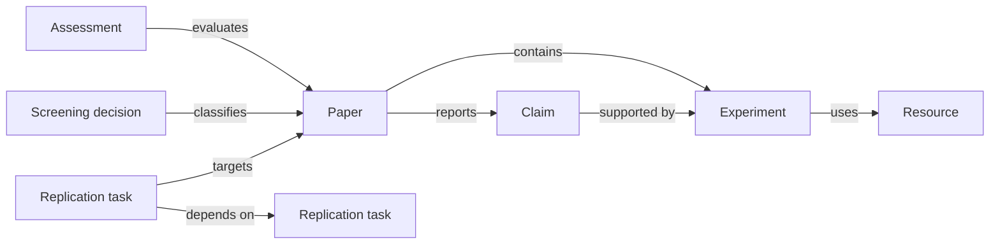

# Data model

ReproWeave stores one JSON object per artifact. Filenames equal artifact IDs, producing stable
diffs and low-conflict reviews.

## Identity rules

IDs start with a lowercase letter and contain lowercase letters, digits, and hyphens. They are
workspace-local. Renaming an ID is a migration because other artifacts may reference it.

## Relationship model

### Paper

Bibliographic identity used by the rest of the workspace. ReproWeave intentionally stores only a
small portable subset. Rich citation management belongs in the source citation manager.

### Claim

A bounded statement with an `evidence_locator`. `confidence` records the reviewer's current
relationship to the statement: reported, corroborated, contested, or uncertain. It is not a
probability.

### Experiment

A protocol summary that links a paper to the resources required to reconstruct a result.
`metric_ids` and `baseline_ids` are open ID lists reserved for workspaces that model those
concepts as resources or extensions.

### Resource

Code, dataset, environment, model, hardware, protocol, result, or other dependency. Availability
is separate from URL presence. A repository can be reachable but only partially usable.

### Assessment

Eight dimension records with a rating, evidence note, and optional next action. Multiple
assessment files may point to one paper; the current report assumes the last lexicographic
assessment ID is not special and will list each card. Teams should establish an ID convention for
assessment rounds.

### Task

A node in the replication directed acyclic graph. Dependencies must point to other task IDs.
`acceptance` should describe observable completion evidence, not activity.

### Screening

An appendable decision record for discovery, deduplication, screening, inclusion, or exclusion.
The v1 demo uses one terminal record per paper. Longitudinal workflows can retain multiple
timestamped IDs.

## Forward compatibility

Runtime validators allow additional properties so laboratories can add namespaced fields without
forking the tool. Core commands ignore unknown fields. Removing or changing a core field requires
a format-version migration.

Published JSON Schemas live in [`schemas/`](../schemas/). The Python runtime deliberately does
not require a JSON Schema package.

