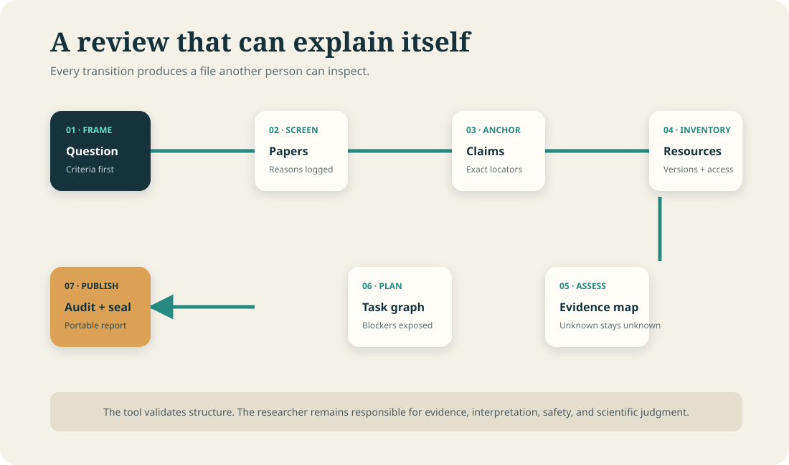

# End-to-end workflow

## Frame

Write the research question and inclusion criteria before evaluating papers. This prevents the
rubric from silently changing to favor a preferred result.

## Import and screen

Import identifiers and basic metadata from the citation manager you already use. Record explicit
inclusion or exclusion reasons. ReproWeave does not automate database search.

## Anchor

Split headline statements into bounded claims. Add an exact evidence locator and connect each
claim to the experiment that could support it.

## Inventory

Record required code, data, environments, models, hardware, protocols, and result bundles.
Availability is a reviewed state, not inferred from whether a URL field is present.

## Assess

Rate the eight dimensions and write evidence for every rating. Unknown is a legitimate state and
usually becomes a next action.

## Plan

Turn missing access, reconstruction, execution, and comparison work into tasks with dependencies
and observable acceptance criteria.

## Audit, seal, and report

Fix structural errors, decide whether warnings are acceptable, seal the source snapshot, and
generate a portable report for review. If the workspace changes, generate a new seal rather than
editing the old root.

